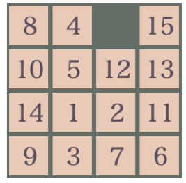

画像クリックでその話題のページに飛びます。

## 🔭 My self-made software (自作プログラム)
I develop programs for work (research on soil physics) and for fun. Here you can find some of my published programs. See also my [Python packages](https://pypi.org/user/seki/) and [App Store profile](https://apps.apple.com/developer/katsutoshi-seki/id1692159497).

### Puzzle (パズル)
[Sudoku Kaidoku](https://sekika.github.io/kaidoku/sudoku) ([ナンプレ解独](https://sekika.github.io/kaidoku/ja/sudoku)) - Online puzzles with various difficulty. Also available:

*  for iPhone / iPad / Mac
* [PDF books](https://sekika.github.io/kaidoku/book)
* [Command-line](https://sekika.github.io/kaidoku/)

[15 Puzzle](https://sekika.github.io/2020/01/14/15Puzzle/) ([15パズル](https://sekika.github.io/2020/01/17/15Puzzle/)) - online player of a sliding puzzle. The size of the puzzle can be changed to 3, 8, 15, 24, 35, ...

### Soil physics (土壌物理学)
- [SWRC Fit](https://seki.webmasters.gr.jp/swrc/) - a web interface for fitting [soil water retention curve](https://en.wikipedia.org/wiki/Water_retention_curve) used in [many researches](https://scholar.google.com/citations?view_op=view_citation&hl=en&user=Gs_ABawAAAAJ&citation_for_view=Gs_ABawAAAAJ:9yKSN-GCB0IC). 
- [Unsatfit](https://sekika.github.io/unsatfit/) - Python library for optimizing parameters of functions of soil hydraulic properties. SWRC Fit uses unsatfit, and unsatfit also fits unsaturated hydraulic conductivity.
- [UNSODA viewer](https://sekika.github.io/unsoda/) - View UNSODA database.
- [EC fit](https://seki.webmasters.gr.jp/ecfit/) - fit soil water and electrical conductivity (EC) model to measured data.
- [Discfit](https://github.com/sekika/discfit) - read disc permeameter data in the field and calculates hydraulic parameters of the soil.
- Recommendation - [お薦め](https://www.jstage.jst.go.jp/article/jssoilphysics/148/0/148_45/_article/-char/ja/)していただきました。

### Security (セキュリティ)
- [Passme](https://github.com/sekika/passme/blob/master/doc/README.rst) - a password management tool with command line or web browzer. [Tutorial movie](https://youtu.be/6DXPhyYhYsE).

### その他
- [JavaScript の小物](https://sekika.github.io/tags/javascript/index.html)
- [Python の小物](https://sekika.github.io/tags/python/index.html)

## 🌱 Non-IT stuffs
- [Academic CV](https://researchmap.jp/sekik/) and [most cited papers](https://scholar.google.com/citations?user=Gs_ABawAAAAJ)
- [Photos with Moomin family ](https://seki.webmasters.gr.jp/photo/moomin2011/)
- [YouTube videos](https://www.youtube.com/channel/UCcrzhK0Uy9b4tWf1uhbWN-Q/videos)
- [メモ帳](https://sekika.github.io)
- [ケトルベルトレーニングのログ ](kettlebell/Readme.md)
- [詰将棋のページ](https://seki.webmasters.gr.jp/shogi/tume/index.html) 1996年5月30日開設

## 📫 How to reach me
- If you like my software, I always welcome your feedback by mentioning me at [twitter](https://twitter.com/seki) in English or Japanese.
- Please find my email address in [this paper](https://acsess.onlinelibrary.wiley.com/doi/10.1002/vzj2.20168).

<!--
**sekika/sekika** is a ✨ _special_ ✨ repository because its `README.md` (this file) appears on your GitHub profile written in Python.

Here are some ideas to get you started:

- 🔭 I’m currently working on ...
- 🌱 I’m currently learning ...
- 👯 I’m looking to collaborate on ...
- 🤔 I’m looking for help with ...
- 💬 Ask me about ...
- 📫 How to reach me: ...
- 😄 Pronouns: ...
- ⚡ Fun fact: ...
-->
