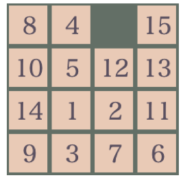

## 🔭 My self-made software (自作プログラム)
I develop programs for work (research on soil physics) and for fun. Here you can find some of my published programs. See also my [Python packages](https://pypi.org/user/seki/), [Rust crates](https://crates.io/users/sekika), [Go packages](https://pkg.go.dev/search?q=github.com%2Fsekika&m=package) and mobile apps at [App Store](https://apps.apple.com/developer/katsutoshi-seki/id1692159497) and [Google Play](https://play.google.com/store/apps/dev?id=9194226144632155310).

### Soil physics (土壌物理学)
- [SWRC Fit](https://seki.webmasters.gr.jp/swrc/) - a web interface for fitting [soil water retention curve](https://en.wikipedia.org/wiki/Water_retention_curve) used in [many researches](https://scholar.google.com/citations?view_op=view_citation&hl=en&user=Gs_ABawAAAAJ&citation_for_view=Gs_ABawAAAAJ:9yKSN-GCB0IC). 
- [unsatfit](https://sekika.github.io/unsatfit/) - Python library for optimizing parameters of functions of soil hydraulic properties. SWRC Fit uses unsatfit, and unsatfit also fits unsaturated hydraulic conductivity.
- [hystfit](https://sekika.github.io/hystfit/) - Python library for calculating hysteresis of soil water retention curve.
- [UNSODA viewer](https://sekika.github.io/unsoda/) - View UNSODA database.
- [EC fit](https://seki.webmasters.gr.jp/ecfit/) - fit soil water and electrical conductivity (EC) model to measured data.
- [discfit](https://github.com/sekika/discfit) - read disc permeameter data in the field and calculates hydraulic parameters of the soil.
- Recommendation - [お薦め](https://www.jstage.jst.go.jp/article/jssoilphysics/148/0/148_45/_article/-char/ja/)していただきました。

### Puzzle / Game (パズル / ゲーム)
[Sudoku Kaidoku](https://sekika.github.io/kaidoku/sudoku/) - Online puzzles with various difficulty. Also available:

*  
* [PDF books](https://sekika.github.io/kaidoku/book)
* [Command-line](https://sekika.github.io/kaidoku/) ([Downloads](https://pepy.tech/projects/kaidoku))
* [Sudoku quiz](https://twilog.togetter.com/seki/search?word=%23sudoku)

[Dodgem](https://sekika.github.io/dodgem/) ([ドッジェム](https://sekika.github.io/dodgem/ja/)) - abstract strategy game

[15 Puzzle](https://sekika.github.io/2020/01/14/15Puzzle/) ([15パズル](https://sekika.github.io/2020/01/17/15Puzzle/)) - online player of a sliding puzzle. The size of the puzzle can be changed to 3, 8, 15, 24, 35, ...

### Math
- [二項分布とポアソン分布](https://sekika.github.io/2020/11/20/Binomial/) / [ポアソン分布と正規分布](https://sekika.github.io/2020/01/04/Poisson/)
- [正規分布の必然性に関する考察](https://researchmap.jp/sekik/published_papers/48975147/attachment_file.pdf)の付録プログラム
- [compute-pi](https://crates.io/crates/compute-pi) - compute 1 million digits of &pi; in a few seconds (Rust)

### Utility
- [slidemovie](https://sekika.github.io/slidemovie/) - Markdown and PowerPoint to narration video generator
- [md-llm-lang-reader](https://sekika.github.io/2025/12/19/langreader/) - Generate language-learning HTML readers (with sentence-level LLM translations and TTS) from Markdown.
- [paperfig](https://sekika.github.io/paperfig/) - JSON-driven orchestration for building and concatenating paper figures.
- [pdfgridcat](https://pypi.org/project/pdfgridcat/) - arrange multiple PDF pages into a grid without scaling or margins.
- [findstring](https://pypi.org/project/findstring/) - search for a string in files recursively.
- [multiai](https://sekika.github.io/multiai/) - Python library and command-line tool designed to interact with text-based generative AI models.
- [passme](https://sekika.github.io/passme/) - a password management tool with command line or web browzer.
- [Link Checker for Go](https://pkg.go.dev/github.com/sekika/linkchecker) - Concurrently checks links in URLs or local HTML files, controlling request intervals to the same host to prevent overload.

### その他
- [JavaScript の小物](https://sekika.github.io/tags/javascript/index.html)
- [Python の小物](https://sekika.github.io/tags/python/index.html)
- [Rust のプログラム](https://sekika.github.io/tags/rust/)
- [Go の記事](https://sekika.github.io/tags/go/index.html)
- [Zenodo archive](https://zenodo.org/search?q=metadata.creators.person_or_org.name%3A%22Seki%2C%20Katsutoshi%22&l=list&p=1&s=10&sort=bestmatch)

## 🌱 Non-IT stuffs
- [Academic CV](https://researchmap.jp/sekik/) and [most cited papers](https://scholar.google.com/citations?user=Gs_ABawAAAAJ)
- [Photos with Moomin family ](https://seki.webmasters.gr.jp/photo/moomin2011/)
- [メモ帳](https://sekika.github.io)
- [ケトルベルトレーニング ](kettlebell/Readme.md)
- [ゲームのページ](https://seki.webmasters.gr.jp/) 自作詰将棋等、1996年開設

- [父の遺言 ](nakayoshi.md)

## 👯 SNS accounts
- [Twitter @seki](https://twitter.com/seki)
- [Linkedin @sekik](https://www.linkedin.com/in/sekik/)
- [YouTube](https://www.youtube.com/channel/UCcrzhK0Uy9b4tWf1uhbWN-Q)
- [pebble @seki](https://pebble.is/seki)
- [Facebook](https://www.facebook.com/katsutoshi.seki)
- [Bluesky @sekik.bsky.social](https://bsky.app/profile/sekik.bsky.social) requires sign in ([Feed](bluesky/feed.md))
- [詰将棋メーカー](https://tsumeshogi.com/users/sekik)
- Note that SNS accounts with the same name with me may not be my accout if not listed here

## 📫 How to reach me
- If you like my software, I always welcome your feedback by mentioning me at [twitter](https://twitter.com/seki) in English or Japanese.
- Please find my email address in [this paper](https://acsess.onlinelibrary.wiley.com/doi/10.1002/vzj2.20168).

<!--
**sekika/sekika** is a ✨ _special_ ✨ repository because its `README.md` (this file) appears on your GitHub profile written in Python.

Here are some ideas to get you started:

- 🔭 I’m currently working on ...
- 🌱 I’m currently learning ...
- 👯 I’m looking to collaborate on ...
- 🤔 I’m looking for help with ...
- 💬 Ask me about ...
- 📫 How to reach me: ...
- 😄 Pronouns: ...
- ⚡ Fun fact: ...
-->
