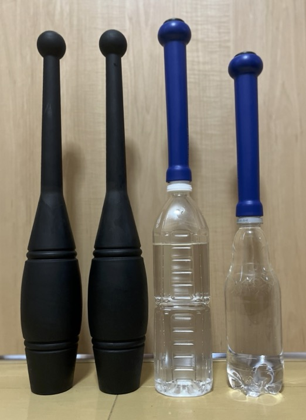

# インディアンクラブ

[インディアンクラブ](https://en.wikipedia.org/wiki/Indian_club)の情報

## 動画

- [Paul Taras Wolkowinski](https://www.youtube.com/c/PaulTarasWolkowinski)

## ルメール法

[Lemaire (1889)](https://openlibrary.org/books/OL7206217M/Indian_clubs_and_how_to_use_them) のまとめ。

- [原著全文](https://archive.org/details/indianclubshowto00lemaiala/)
- [Kindle 再版](https://www.amazon.co.jp/dp/B01NBP5UXR)
- [ルメール法の解説動画](https://youtube.com/playlist?list=PL5jvmrhm1ZVZJXR7kfl760dicnM4WyQqF)

### フロントサークル FC
- 1 - FC右
- 2 - FC左
- 41 - FC逆右
- 42 - FC逆左
- 3 - FC左右同時
- 43 - FC逆左右同時
- 4 - FC左右ずれ
- 44 - FC逆左右ずれ
- 81 - FC右順左逆
- 82 - FC左順右逆

### バックサークル BC
- BC右
- BC左
- BC逆右
- BC逆左
- 5 - FCBC右
- 6 - FCBC左
- 45 - FC逆BC逆右
- 46 - FC逆BC逆左
- 7 - FC2BC2右
- 8 - FC2BC2左
- 47 - FC逆2BC逆2右
- 48 - FC逆2BC逆2左
- 9 - FCBC左右 [Outword heartshape](https://youtu.be/d42WerJ6fRU)
- 49 - FC逆BC逆左右
- 10 - FC2BC2左右
- 50 - FC2逆BC2逆左右
- 11 - FC右BC左、FC左BC右
- 51 - FC逆右BC逆左、FC逆左BC逆右
- 12 - FC2右BC2左、FC2左BC2右
- 52 - FC逆2右BC逆2左、FC逆2左BC逆2右
- 13 - FC左右、FC右BC左、FC左右、FC左BC右
- 53 - FC逆左右、FC逆右BC逆左、FC逆左右、FC逆左BC逆右
- 14 - FC2左右、FC2右BC左、FC2左右、FC2左BC右
- 54 - FC逆2左右、FC逆2右BC逆左、FC逆2左右、FC逆2左BC逆右
- 83 - FC右順左逆、BC右順左逆
- 84 - FC右順左逆2、BC右順左逆2
- 85 - FC左順右逆、BC左順右逆
- 86 - FC左順右逆2、BC左順右逆2
- 103 - FC左逆・右順、BC左逆・右順（ずれ）
- 104 - FC右逆・左順、BC右逆・左順（ずれ）
- 111 - FC逆左BC右
- 112 - FC逆右BC左
- 113 - FC右BC逆左
- 114 - FC左BC逆右
- 115 - FC逆左BC右、FC右BC逆左
- 116 - FC逆右BC左、FC左BC逆右
- 117 - FC逆左BC右、BC逆左BC右
- 118 - FC逆右BC左、BC逆右BC左
- 119 - FC右BC逆左、BC右BC逆左
- 120 - FC左BC逆右、BC左BC逆右

### フロントリストサークル FW
- 21 - FW右
- 22 - FW左
- 61 - FW逆右
- 62 - FW逆左
- 23 - FCFWBC右
- 24 - FCFWBC左
- 63 - FC逆BC逆FW逆右
- 64 - FC逆BC逆FW逆左
- 25 - FC2FW2BC2右
- 26 - FC2FW2BC2左
- 65 - FC逆2FW逆2BC逆2右
- 66 - FC逆2FW逆2BC逆2左
- 36 - FC右FW左、FC左FW右
- 76 - FC逆右FW逆左、FC逆左FW逆右

## サイドリストサークル SW
- 15 - SW右
- 16 - SW左
- 55 - SW逆右
- 56 - SW逆左
- 17 - FCBCSW右
- 18 - FCBCSW左
- 57 - FC逆SW逆BC逆右
- 58 - FC逆SW逆BC逆左
- 19 - FC2BC2SW2右
- 20 - FC2BC2SW2左
- 59 - FC逆2SW逆2BC逆2右
- 60 - FC逆2SW逆2BC逆2左
